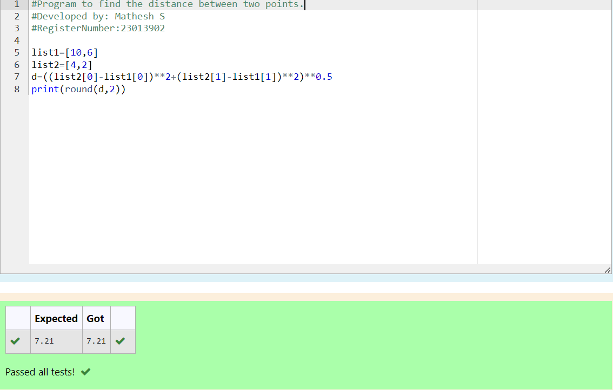

# DISTANCE-BETWEEN-TWO-POINTS

## AIM:
To write a python program to find the distance two 2 points
## ALGORITHM:

### Step 1: 
Import the math module.

### Step 2:
Assign the value of the variable

### Step 3: 
Substitute the values in the distance formula  

### Step 4: 
Print the distance.

### Step 5: 
Stop the program

### PROGRAM:
```
#Program to find the distance between two points.
#Developed by: Mathesh S
#RegisterNumber:23013902

list1=[10,6]
list2=[4,2]
d=((list2[0]-list1[0])**2+(list2[1]-list1[1])**2)**0.5
print(round(d,2))
```  

### OUTPUT:


### RESULT:
Thus the distance between two points executed successfully
